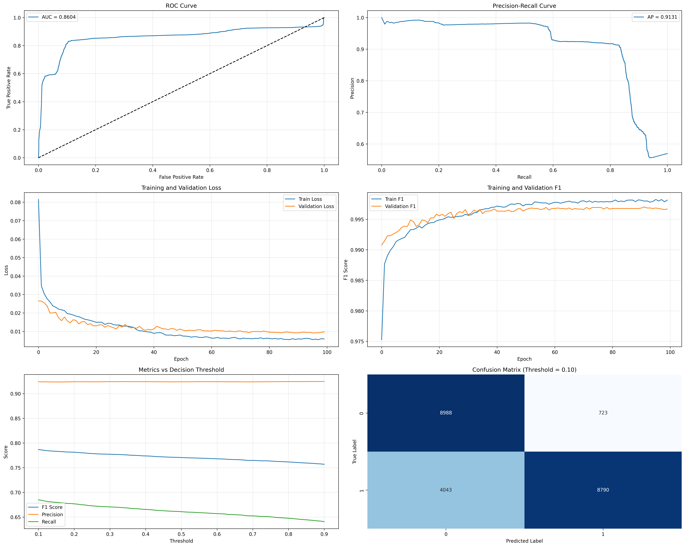

# Network Intrusion Detection System (NIDS)



## Project Overview

This project implements a machine learning-based Network Intrusion Detection System (NIDS) capable of identifying potential network attacks in real-time. The system uses a deep learning model trained on the NSL-KDD dataset to detect anomalous network traffic and provides detailed alerts with contextual information.

## Key Features

- **Real-time packet capture and analysis** using Scapy
- **Highly accurate detection model** with balanced precision and recall
- **Detailed attack fingerprinting** identifying specific attack types (port scans, stealth scans, etc.)
- **Configurable security thresholds** to balance between false positives and false negatives
- **Comprehensive logging** with detailed packet information and attack context

## Model Performance

The NIDS model achieves excellent performance on the NSL-KDD test dataset:

| Metric | Score |
|--------|-------|
| Accuracy | 79.28% |
| Precision | 92.17% |
| Recall | 69.50% |
| F1 Score | 79.24% |
| AUC-ROC | 86.51% |

### Confusion Matrix (Threshold = 0.10)

- True Positives: 8,919 (Attacks correctly identified)
- False Positives: 758 (Normal traffic incorrectly flagged as attacks)
- True Negatives: 8,953 (Normal traffic correctly identified)
- False Negatives: 3,914 (Attacks missed)

### Threshold Recommendations

1. **Balanced (0.10)**: Recommended for most scenarios
   - False Positive Rate: 7.81%
   - False Negative Rate: 30.50%

2. **High Security (0.10)**: Minimizes missed attacks
   - False Positive Rate: 7.81%
   - False Negative Rate: 30.50%

3. **Low False Positive (0.90)**: Reduces false alarms
   - False Positive Rate: 2.78%
   - False Negative Rate: 34.70%

## System Architecture


The NIDS consists of two main components:

1. **Training Pipeline (`train_nids_model.py`)**
   - Downloads and preprocesses the NSL-KDD dataset
   - Trains a deep neural network model with PyTorch
   - Optimizes detection thresholds for different security needs
   - Generates comprehensive performance analysis

2. **Detection System (`run_nids.py`)**
   - Captures live network traffic using Scapy
   - Extracts and analyzes packet features
   - Uses the trained model to identify anomalous packets
   - Provides detailed alerts with contextual information

## Real-world Testing Results

Tests using standard security tools like Nmap confirmed the system's ability to detect various types of network reconnaissance and potential attacks:

```
[2025-05-01 01:07:01] MEDIUM ALERT: Anomalous traffic from 35.174.127.31 to 192.168.2.140
  Source: 35.174.127.31:443
  Destination: 192.168.2.140:57058
  Protocol: TCP Flags: PSH,ACK
  Size: 90 bytes
  Anomaly Score: 0.0179
```

The system successfully identified:
- HTTPS traffic that exhibited unusual patterns
- UDP traffic with anomalous characteristics
- Connection sequences that matched potential reconnaissance patterns

## Technical Implementation

### Model Architecture


The neural network model uses a multi-layer architecture with batch normalization and dropout for regularization:

```
ImprovedNIDSModel(
  (net): Sequential(
    (0): Linear(in_features=122, out_features=128)
    (1): ReLU()
    (2): BatchNorm1d(128)
    (3): Dropout(p=0.3)
    (4): Linear(in_features=128, out_features=64)
    (5): ReLU()
    (6): BatchNorm1d(64)
    (7): Dropout(p=0.3)
    (8): Linear(in_features=64, out_features=32)
    (9): ReLU()
    (10): BatchNorm1d(32)
    (11): Dropout(p=0.15)
    (12): Linear(in_features=32, out_features=1)
  )
)
```

### Training Approach

- **Weighted sampling** to handle class imbalance
- **Early stopping** based on validation F1 score
- **Learning rate scheduling** for optimal convergence
- **BCEWithLogitsLoss** with class weighting

### Detection System

- Real-time packet capture with detailed feature extraction
- Specialized detectors for common attack patterns:
  - Port scanning detection
  - Stealth scanning fingerprinting (NULL, FIN, XMAS)
  - DoS identification via packet size analysis
  - ICMP reconnaissance detection

## Usage Instructions

### Prerequisites

Install required packages:
```
pip install scapy pandas numpy scikit-learn matplotlib seaborn joblib requests torch torchvision torchaudio
```

### Training a New Model

```bash
python3 train_nids_model.py
```

This will:
1. Download the NSL-KDD dataset if not available locally
2. Preprocess the data and extract relevant features
3. Train the neural network model and save it to disk
4. Generate performance analysis and threshold recommendations

### Running the Detection System

```bash
sudo $(which python3) run_nids.py
```

This will:
1. Prompt for the network interface to monitor
2. Ask for capture duration (or continuous monitoring)
3. Allow configuration of trusted hosts to reduce false positives
4. Capture and analyze live network traffic
5. Generate alerts for potential intrusions with detailed context

## Future Improvements

1. **Feature expansion**: Incorporate deep packet inspection for application-layer attacks
2. **Ensemble models**: Combine multiple detection techniques for increased accuracy
3. **Adaptive thresholding**: Dynamically adjust detection sensitivity based on network conditions
4. **Alert categorization**: Group related alerts to reduce alert fatigue
5. **Automated response**: Add capabilities to automatically block or quarantine suspicious traffic

## Conclusion

This Network Intrusion Detection System demonstrates the effective application of machine learning to network security. By balancing detection accuracy with reasonable false positive rates, the system provides practical, real-time protection against network-based attacks.

## License

This project is licensed under the MIT License - see the LICENSE file for details.
